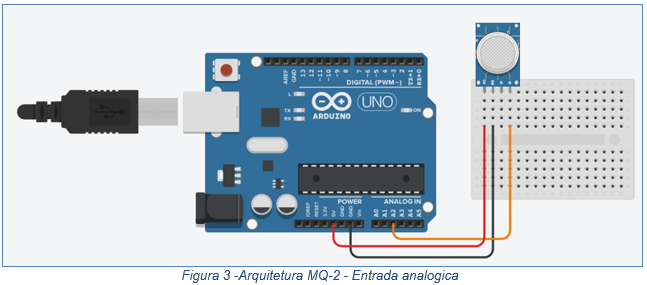

# Aerasense - Tecnologia que detecta, segurança que protege.

## Projeto de Pesquisa e Inovação - São Paulo Tech School

##  Descrição do Projeto

O **Aerasense** é uma solução de software desenvolvida para âmbito acadêmico no 1º semestre do curso de **Ciência da Computação** da São Paulo Tech School - SPTECH ([@BandTec](https://github.com/BandTec)) para detecção de GLP (Gás Liquefeito de Petróleo) em cozinhas industriais, com foco em segurança monitoramento contínuo e resposta rápida a situações de risco.

Este projeto usufrui de uma _API_ em **NodeJS** que usa bibliotecas como:

* **_serialport_** - Biblioteca de comunicação com o Arduino;
* **_mysql2_** - Conexão com o banco de dados MySQL;
* **_express_** - Estruturação do Servidor Web para requisições HTTP;
* **_dotenv_** - Para variáveis de ambiente.

## Requisitos de Hardware e Software

Para executar o projeto em ambiente real, são necessários:

### Hardware

* Arduino UNO R3
* Sensor de gás MQ-2
* Protoboard
* Três cabos jumpers
* Cabo USB para comunicação com o Arduino
* Computador compatível

### Software 

* MySQL Server 8.0+;
* NodeJS;
* Bibliotecas descritas acima instaladas

Abaixo segue um esquema de ligação do Arduino UNO R3 com o sensor MQ-2



## Instalação

Você pode clonar este repositório em seu computador e instalar todas as dependências usando o `npm` no terminal:

```
git clone https://github.com/arthurrogeriozip/aerasensewebdata/aerasense.git
cd aerasense/
npm install
```

Para executar o servidor, você pode executar no terminal:
```
npm start
```

## Execução


Para iniciar o servidor:

```
npm start
```

## Equipe de desenvolvimento

- Arthur Rogério - [(arthurrogeriozip)](https://github.com/arthurrogeriozip)

- Aurora Carvalho - [(aurora-carvalhoi)](https://github.com/aurora-carvalhoi)

- Gabriel Marques - [(GabrielMarRib)](https://github.com/GabrielMarRib)

- Marley Santos - [(MarleyS439)](https://github.com/MarleyS439)

- Murilo Santos - [(Murilo2305)](https://github.com/Murilo2305)

- Pedro Augusto - [(pedro-augusto-lemos-rodrigues)](https://github.com/pedro-augusto-lemos-rodrigues)

